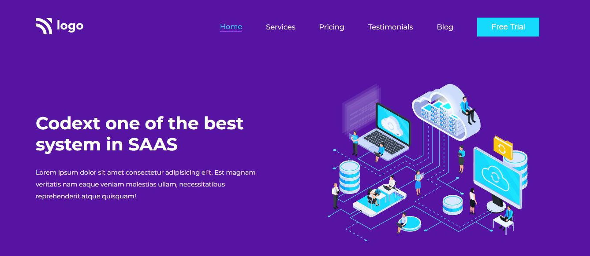
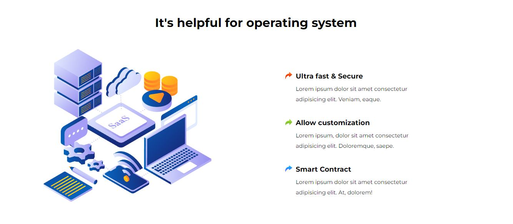
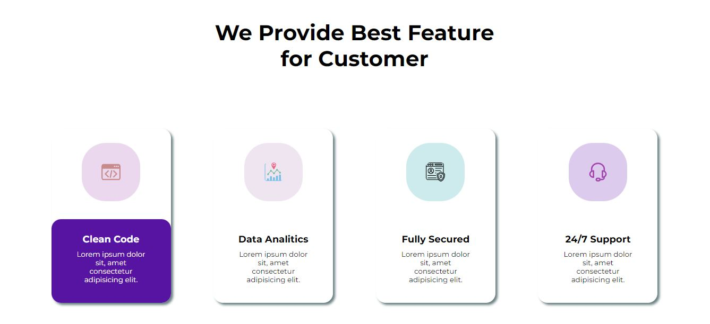

# Assignment 13

 

---

## Project 13 [Live link]()
- Skills Gained in this project
    - Learned about object postions.
    - Learned various flexbox properties.
    - Learned to make cards.
    - Learned about image positioning and allignment.
    - Learned to write mediaquery for responviveness.
---

## Time taken to finish this project

- 14 hour taken to Finish this project.

Screenshots

- 1 

- 2 

- 3 

